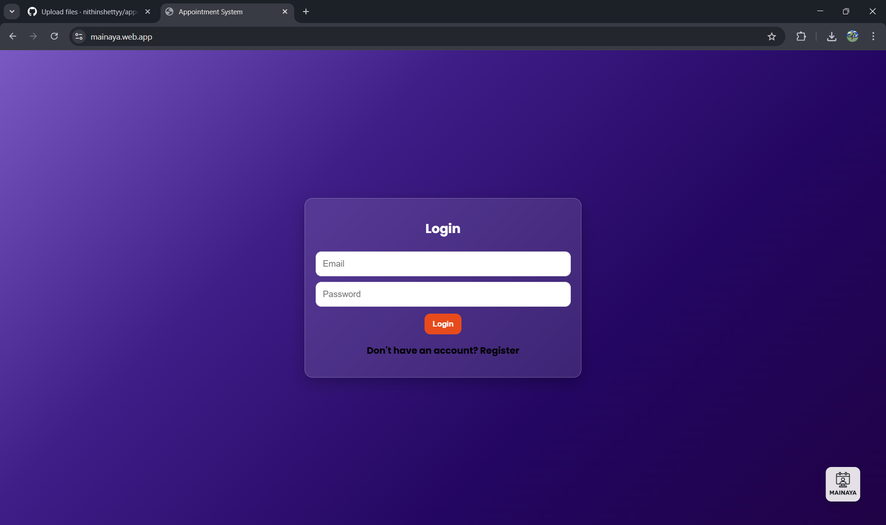
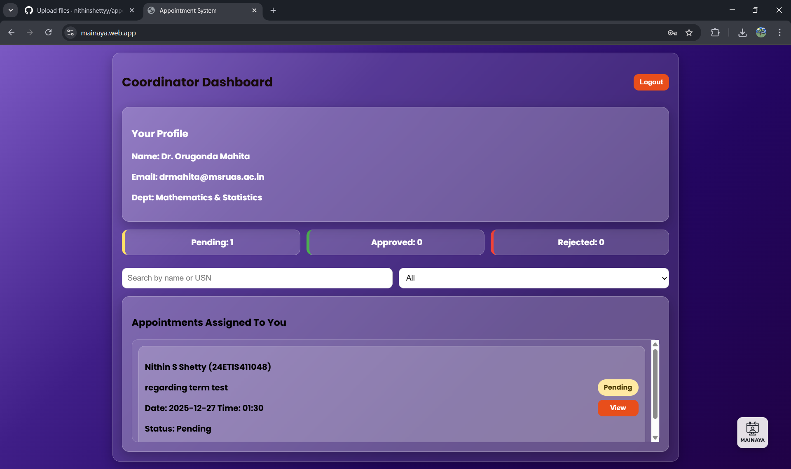
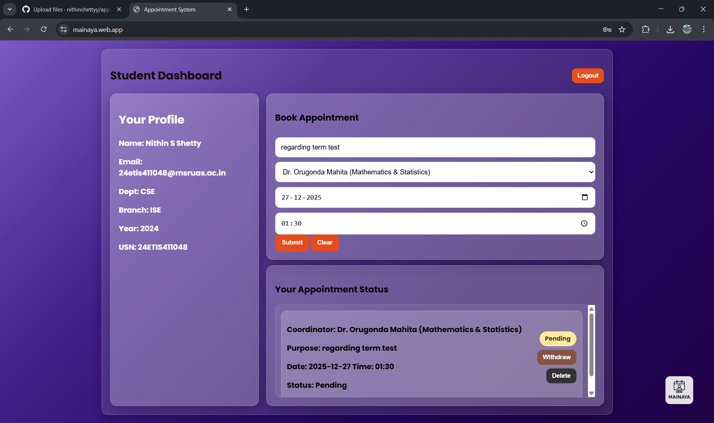
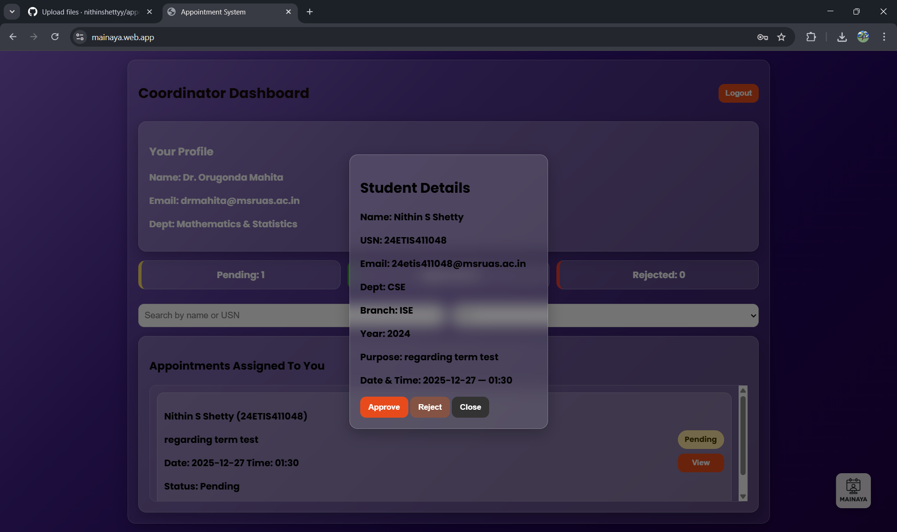
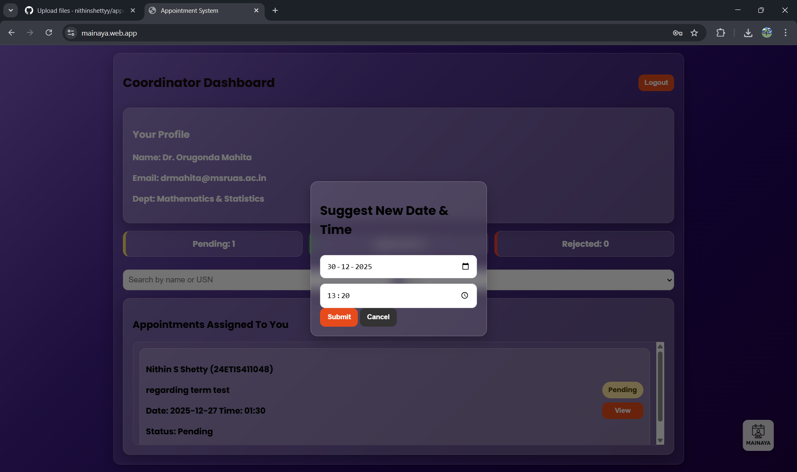

# 📅 Mainaya - Virtual Appointment Management System

A web-based appointment management system built using Firebase that enables students to schedule appointments with coordinators and allows coordinators to manage, approve, or reject appointment requests efficiently through a simple and user-friendly interface.

🔗 **Live Demo:** [https://mainaya.web.app/](https://mainaya.web.app/)

## 📌 Problem Statement

Manual appointment scheduling often leads to conflicts, missed appointments, and inefficient time management. A digital solution is needed to streamline the appointment booking and management process between students and coordinators.

## 💡 Solution

The Appointment Management System provides a centralized platform where users can:

* Schedule appointments
* View existing appointments
* Update appointment details
* Cancel appointments
* Manage appointment requests efficiently

All data is stored and managed using Firebase, eliminating the need for a separate backend server.

## 🖼️ Screenshots

### Login Page

### Student Dashboard

### Coordinator Dashboard

### Request Submission

### View Requests

### Suggested Date & Time

### Approve / Reject Requests

## 🛠️ Tech Stack

### Frontend
* HTML
* CSS
* JavaScript

### Backend & Database
* Firebase Firestore

### Authentication
* Firebase Authentication

### Tools
* VS Code
* Git
* GitHub

## ⚙️ Features

* Student registration and login
* Submit appointment requests (purpose, coordinator, date, time)
* Coordinator can view all pending requests
* Approve or reject appointment requests
* Suggest alternative date/time on rejection
* Real-time status tracking (Pending / Approved / Rejected)
* Real-time data storage using Firebase
* Secure logout functionality
* Simple and responsive user interface

## 🔄 System Workflow

1. User logs in to the system (Student or Coordinator).
2. Student submits appointment details (purpose, coordinator, date, time).
3. Appointment data is stored in Firebase with "Pending" status.
4. Coordinator reviews the pending requests.
5. Coordinator approves or rejects the request (with a suggested alternative time if rejected).
6. Updated appointment status is displayed in real time on the student's dashboard.

## 🔐 Firebase Services Used

* Firebase Authentication
* Firebase Firestore
* Firebase Hosting

## 🚀 Future Enhancements

* Email appointment reminders
* SMS notifications
* Calendar integration
* Forgot password functionality
* Analytics dashboard
* Admin management panel

## 📚 What I Learned

* Firebase Authentication
* Firebase Firestore Database Integration
* Frontend Development using HTML, CSS, and JavaScript
* Hosting applications using Firebase
* Version Control using Git and GitHub

## 🧩 Challenges Faced

* Designing an efficient appointment workflow
* Managing real-time database updates
* Integrating Firebase services
* Creating a user-friendly interface for students and coordinators

## 👨‍💻 Author

**Nithin S Shetty**

Email: nithinsshetty3@gmail.com
GitHub: [https://github.com/nithinsshetty](https://github.com/nithinsshetty)